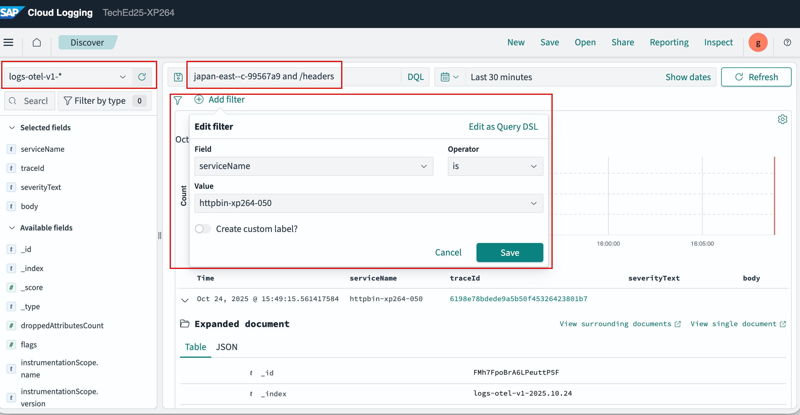
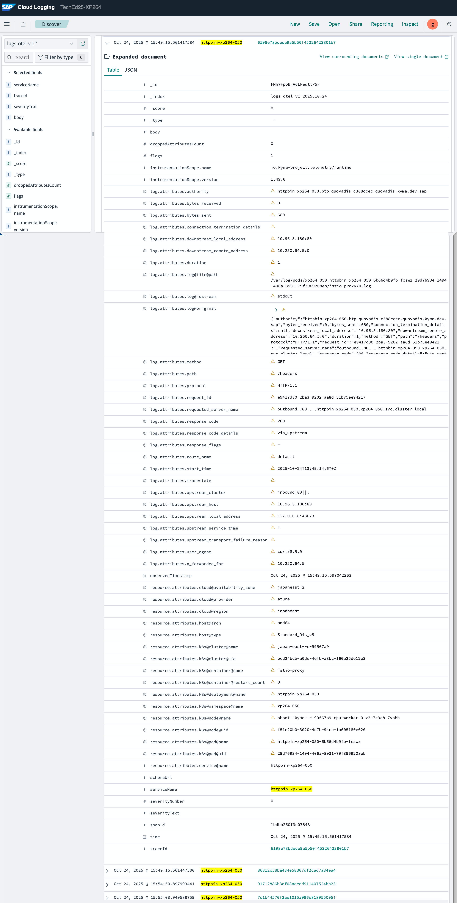
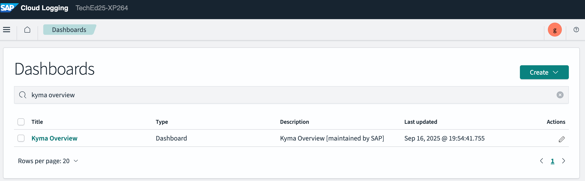
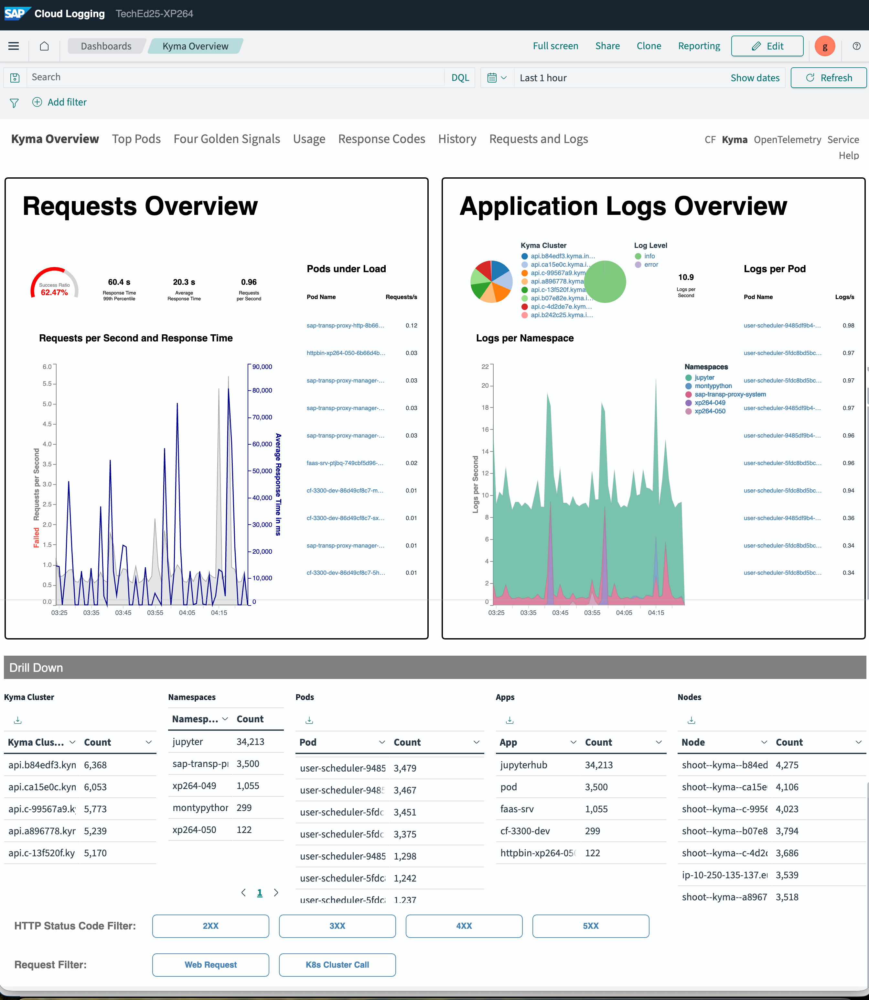
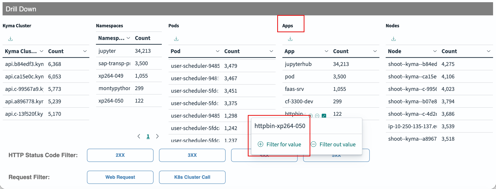
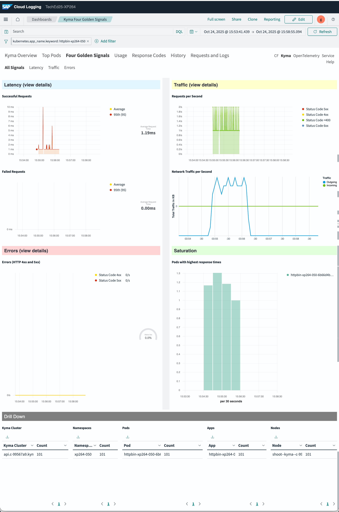
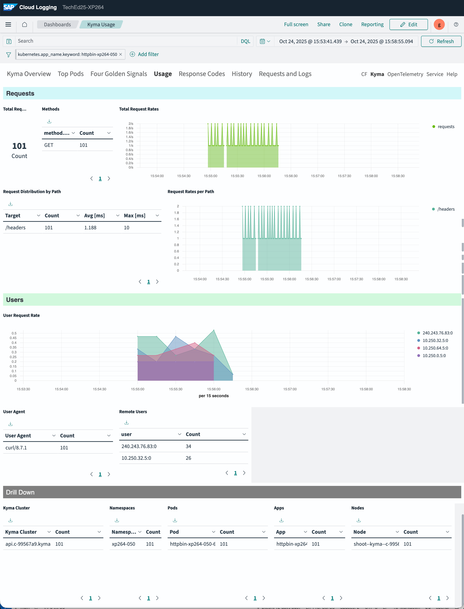

# Exercise 3 - Exploring Kyma Telemetry with SAP Cloud Logging

## Exercise 3.0 - Simulate some load

Lets make some HTTP requests to the Httpbin application previously deployed in the Kyma runtime.

- Run the student workflow from the table below:

 | Kyma Region (BTP Cockpit) |  Console (dashboard) | Admin Worklow (cluster-wide) | Student Workflow (namespaced)| Data Collection Workflow (namespaced)
 | :---------  | --------- | :--------- | :------- | -----------
 | [uk-south](https://emea.cockpit.btp.cloud.sap/cockpit?idp=anuk8cmfw.accounts.ondemand.com#/globalaccount/c1f19148-71f7-4883-9f86-8d5ee7634dec/subaccount/4457fb7f-3296-40cf-b66b-aac3d9d4a2b2) |  | [uk-south--admin](../../../../actions/workflows/uk-south-teched-7a69075f-7faf-4604-a62e-806648791dba.yml) | [uk-south--xp264](../../../../actions/workflows/uk-south-teched-7a69075f-7faf-4604-a62e-806648791dba-xp264.yml)| [ k8s-data-context-student](../../../../actions/workflows/k8s-data-context-student.yml)
 | [japan-east](https://emea.cockpit.btp.cloud.sap/cockpit?idp=anuk8cmfw.accounts.ondemand.com#/globalaccount/c1f19148-71f7-4883-9f86-8d5ee7634dec/subaccount/cae18034-657b-478d-89f7-b802b8111cd0) |  | [japan-east--admin](../../../../actions/workflows/japan-east-teched-2a6fe480-ac84-4751-ad37-56ec2a493932.yml) | [japan-east--xp264](../../../../actions/workflows/japan-east-teched-2a6fe480-ac84-4751-ad37-56ec2a493932-xp264.yml) | [k8s-data-context-student](../../../../actions/workflows/k8s-data-context-student.yml)
 | [us-east](https://emea.cockpit.btp.cloud.sap/cockpit?idp=anuk8cmfw.accounts.ondemand.com#/globalaccount/c1f19148-71f7-4883-9f86-8d5ee7634dec/subaccount/831741eb-0b10-4d2c-9feb-c49afec286f5) |  | [us-east--admin](../../../../actions/workflows/btp-runtime-teched-dbe7346b-88da-430a-8777-4f6aa3e22b5e.yml) | [us-east--xp264](../../../../actions/workflows/btp-runtime-teched-dbe7346b-88da-430a-8777-4f6aa3e22b5e-xp264.yml) | [k8s-data-context-student](../../../../actions/workflows/k8s-data-context-student.yml)
 | [xp264-000](https://emea.cockpit.btp.cloud.sap/cockpit?idp=anuk8cmfw.accounts.ondemand.com#/globalaccount/c1f19148-71f7-4883-9f86-8d5ee7634dec/subaccount/20b6061c-64aa-4397-bc01-df7348704173) |  | [xp264-000--admin](../../../../actions/workflows/xp264-000-teched-622af3fe-a2f5-4fdd-a05f-73e343aec2a5.yml) | [xp264-000--xp264](../../../../actions/workflows/xp264-000-teched-622af3fe-a2f5-4fdd-a05f-73e343aec2a5-xp264.yml) | [k8s-data-context-student](../../../../actions/workflows/k8s-data-context-student.yml)
 | [uk-xp264]() |  | [uk-xp264--admin](../../../../actions/workflows/uk-xp264-teched-76f46b5b-d9ab-486f-8e4f-12e1163af943.yml) | [uk-xp264--xp264](../../../../actions/workflows/uk-xp264-teched-76f46b5b-d9ab-486f-8e4f-12e1163af943-xp264.yml) | [k8s-data-context-student](../../../../actions/workflows/k8s-data-context-student.yml)

- It will make 10 requests to the Httpbin application.
- You can change the request count if you would like to simulate more load.

Once completed, we would navigate to SAP Cloud Logging to explore the three pillars of Kyma Telemetry: Logs, Metrics and Traces.

## Exercise 3.1 - Access SAP Cloud Logging

- Access the SAP Cloud Logging from the Link provided

- Navigate to `Discover` to acess the logs

<table style="width: 100%; border-collapse: collapse; background-color: #f5f5f5;" border="1">
<tbody>
<tr style="height: 193px;">
<td style="width: 71.6%; height: 193px;">

<h1></h1>

</td>
</tr>
</tbody>
</table>

## Exercise 3.2 - Explore Logs  

- Lets explore the logs generated by the Httpbin application.
- Refine the search be introducing the following settings:
  - Index pattern: `log-otel-v1-*`
  - In search bar, enter your cluster name to get only logs from your cluster e.g. `japa-east-c-99567a9` and term `/headers` as we called this URI while simulating load.
  - Add filter for `serviceName` for your application.

<table style="width: 100%; border-collapse: collapse; background-color: #f5f5f5;" border="1">
<tbody>
<tr style="height: 193px;">
<td style="width: 71.6%; height: 193px;">

<h1></h1>

</td>
</tr>
</tbody>
</table>

- Open any one of the log entries to see the details.  

<table style="width: 100%; border-collapse: collapse; background-color: #f5f5f5;" border="1">
<tbody>
<tr style="height: 193px;">
<td style="width: 71.6%; height: 193px;">

<h1></h1>

</td>
</tr>
</tbody>
</table> 

- Feel free to explore further

## Exercise 3.3 - Explore Metrics  

There are some pre-defined dashboards available in SAP Cloud Logging. Let's explore some of them.

- Select `Dashboards` from the left menu

<table style="width: 100%; border-collapse: collapse; background-color: #f5f5f5;" border="1">
<tbody>
<tr style="height: 193px;">
<td style="width: 71.6%; height: 193px;">

<h1></h1>

</td>
</tr>
</tbody>
</table>
- Access the `Kyma Overview` dashboard

<table style="width: 100%; border-collapse: collapse; background-color: #f5f5f5;" border="1">
<tbody>
<tr style="height: 193px;">
<td style="width: 71.6%; height: 193px;">

<h1></h1>

</td>
</tr>
</tbody>
</table>

- Check the overview dashboard. Apply the filters as shown below to narrow down details to your cluster and application

<table style="width: 100%; border-collapse: collapse; background-color: #f5f5f5;" border="1">
<tbody>
<tr style="height: 193px;">
<td style="width: 71.6%; height: 193px;">

<h1></h1>

</td>
</tr>
</tbody>
</table>

<table style="width: 100%; border-collapse: collapse; background-color: #f5f5f5;" border="1">
<tbody>
<tr style="height: 193px;">
<td style="width: 71.6%; height: 193px;">

<h1></h1>

</td>
</tr>
</tbody>
</table>

- Similarly check `Four golden signals` and `usage` dashboards

  * four golden signals

<table style="width: 100%; border-collapse: collapse; background-color: #f5f5f5;" border="1">
<tbody>
<tr style="height: 193px;">
<td style="width: 71.6%; height: 193px;">

<h1></h1>

</td>
</tr>
</tbody>
</table>

  * usage

<table style="width: 100%; border-collapse: collapse; background-color: #f5f5f5;" border="1">
<tbody>
<tr style="height: 193px;">
<td style="width: 71.6%; height: 193px;">

<h1></h1>

</td>
</tr>
</tbody>
</table>

- Feel free to explore further

## Exercise 3.4 - Explore Traces

- Select `Traces` from the left menu

<table style="width: 100%; border-collapse: collapse; background-color: #f5f5f5;" border="1">
<tbody>
<tr style="height: 193px;">
<td style="width: 71.6%; height: 193px;">

<h1></h1>

</td>
</tr>
</tbody>
</table>   

- Select one of the traces to see the details

<table style="width: 100%; border-collapse: collapse; background-color: #f5f5f5;" border="1">
<tbody>
<tr style="height: 193px;">
<td style="width: 71.6%; height: 193px;">

<h1></h1>

</td>
</tr>
</tbody>
</table>   

- The Trace view shows the request flow from istio ingress gateway to the Httpbin application

<table style="width: 100%; border-collapse: collapse; background-color: #f5f5f5;" border="1">
<tbody>
<tr style="height: 193px;">
<td style="width: 71.6%; height: 193px;">

<h1></h1>

</td>
</tr>
</tbody>
</table>

  >Note: Some Trace spans may be jumbled up

- Feel free to explore further

## Summary

Continue to - [Exercise exT2 - Configure Transparent Proxy Kyma Module](../exT2/README.md)
